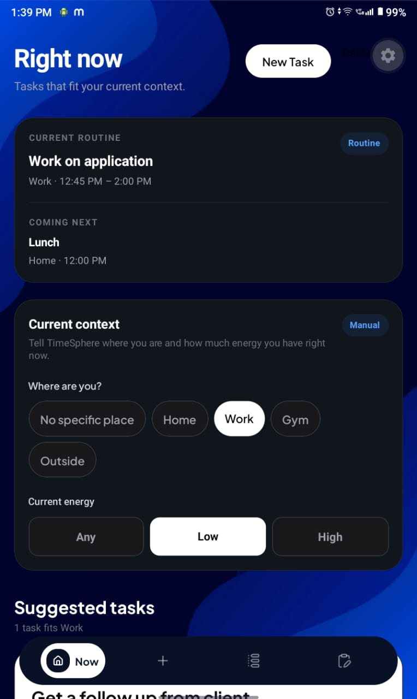
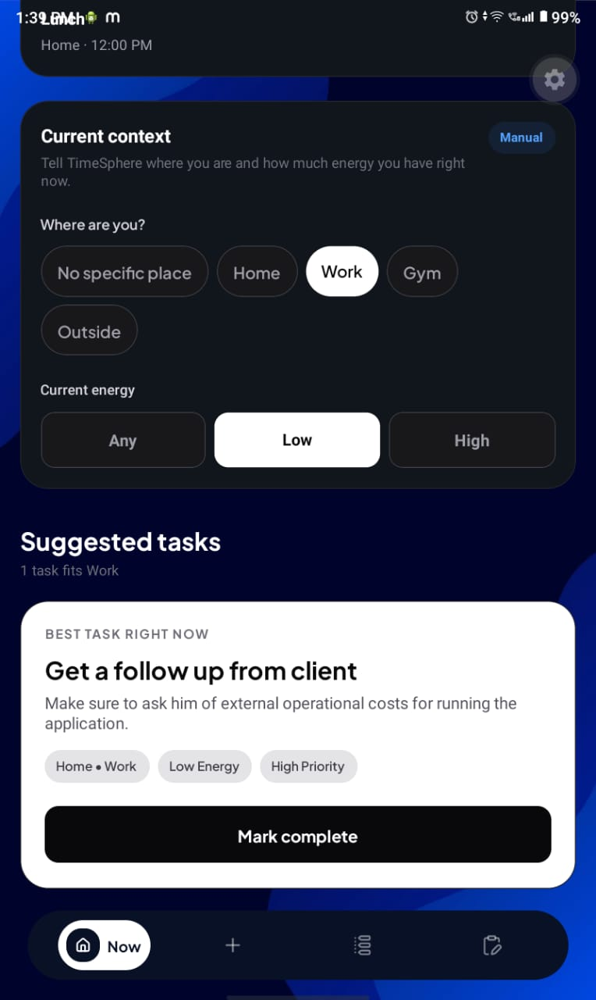
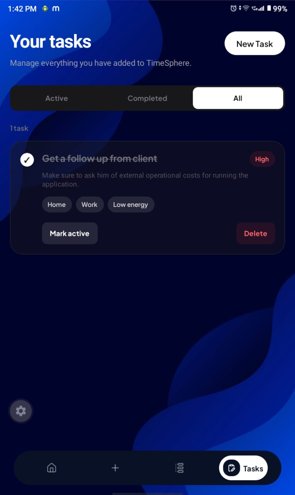
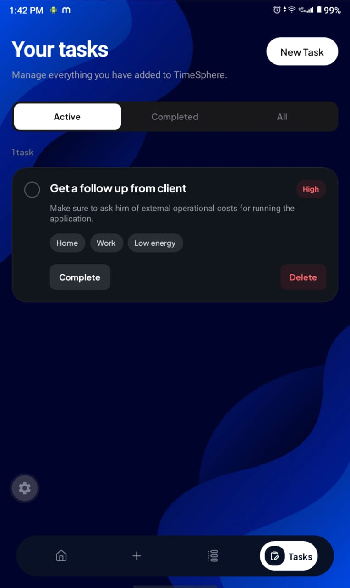
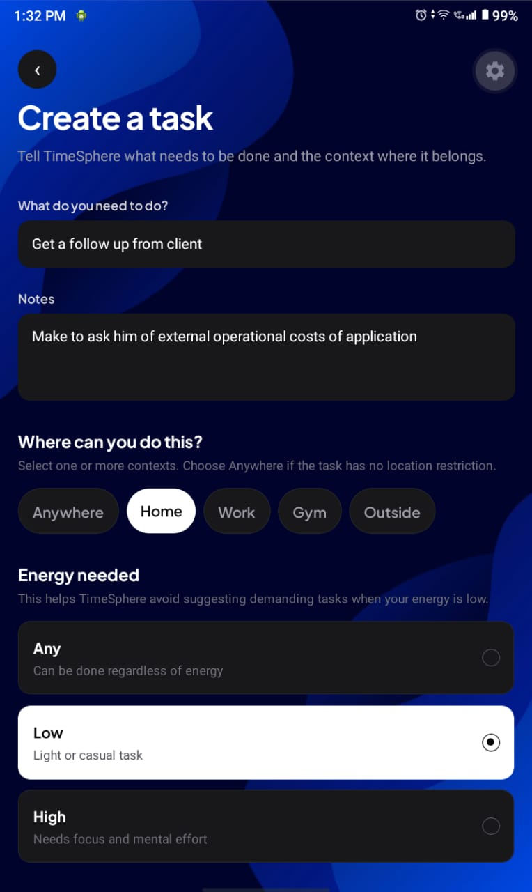
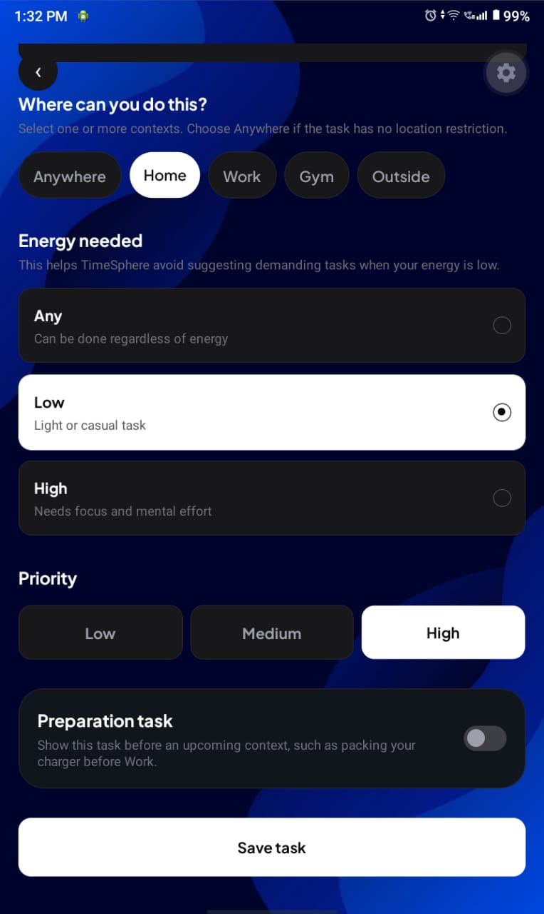
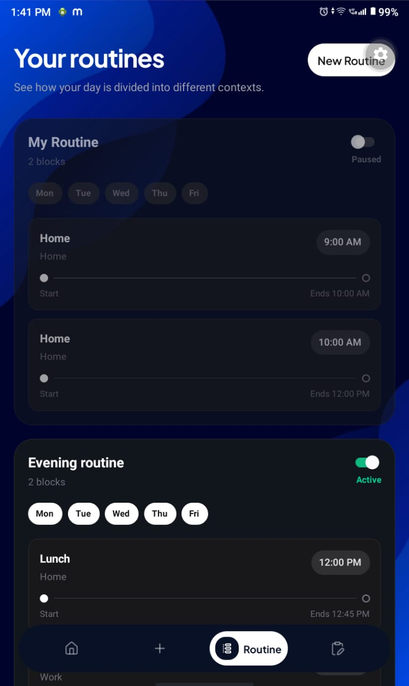
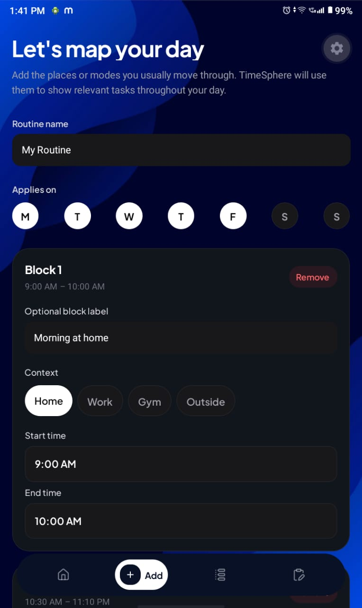
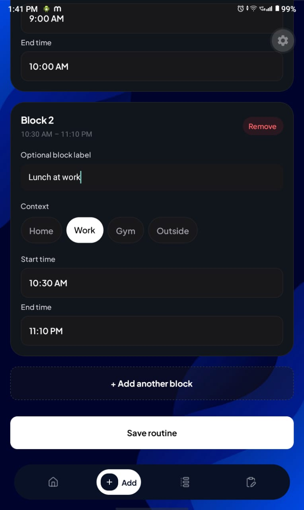

<div align="center">


<h1>TimeSphere</h1>

### A context-aware task manager that surfaces what you can realistically do right now

<p>
  
  
  
  
</p>

<p>
  <a href="#-overview">Overview</a> •
  <a href="#-features">Features</a> •
  <a href="#-how-it-works">How it works</a> •
  <a href="#-getting-started">Getting started</a> •
  <a href="#-roadmap">Roadmap</a>
</p>

</div>

---

## 🌍 Overview

Most task managers show the entire backlog regardless of whether a task is currently practical.

**TimeSphere** takes a context-aware approach. It uses signals such as the active routine, time, energy level, location, Wi-Fi environment, device availability, and manual overrides to determine which tasks are relevant **right now**.

Instead of only asking:

> What do I need to do?

TimeSphere also asks:

> What can I realistically do in my current situation?

The goal is to reduce list fatigue, unnecessary decisions, and the friction of repeatedly reorganising tasks.

---

## ✨ Features

### 🎯 Right Now task feed

Filters the task backlog and surfaces tasks that match the user's current context.

### 🗓️ Routine-based context resolution

Users can create weekday routines made of time blocks. Each block can define:

- one or more active contexts
- start and end times
- expected energy level
- whether the routine is enabled

### 🎛️ Manual context override

Users can temporarily override the automatically resolved context when their real situation differs from their routine.

### ⚡ Energy-aware recommendations

Tasks may require a particular energy level, helping the application avoid recommending demanding work at unsuitable times.

### 📍 Location and Wi-Fi context

The Android native layer can expose device-level context to the React Native application, including information useful for detecting the user's current environment.

### 📱 Device-aware tasks

Tasks can be associated with device-related contexts so they appear only when the required device or environment is available.

### 💾 Local-first persistence

Tasks, routines, and current-context preferences are stored locally, keeping the application responsive and usable without a remote backend.

### 🧩 Native Android integration

TimeSphere includes a custom Kotlin native module connected to React Native through code generation.

---

## 🧠 How it works

```text
┌─────────────────────┐
│ Routine and time    │
├─────────────────────┤
│ Manual override     │
├─────────────────────┤
│ Location / Wi-Fi    │
├─────────────────────┤
│ Device context      │
├─────────────────────┤
│ Energy level        │
└──────────┬──────────┘
           │
           ▼
┌─────────────────────┐
│ Context resolver    │
└──────────┬──────────┘
           │
           ▼
┌─────────────────────┐
│ Task matching logic │
└──────────┬──────────┘
           │
           ▼
┌─────────────────────┐
│ Right Now feed      │
└─────────────────────┘
```

The application follows this flow:

1. Load saved tasks, routines, and context preferences.
2. Resolve the active routine block using the current weekday and time.
3. Apply a manual override when one is active.
4. Combine routine data with energy, device, location, and native context signals.
5. Match tasks against the resolved context.
6. Display only the tasks that are actionable in the current situation.

---

## 🏗️ Architecture

```text
app/
├── (tabs)/                 Main tab-based screens
├── routine/                Routine creation and management
├── task/                   Task creation and editing
└── _layout.tsx             Root navigation configuration

components/
├── CurrentContextSelector  Context and energy controls
├── RightNowTaskCard        Context-matched task presentation
└── ...                     Shared interface components

services/
├── taskStorage             Task persistence
├── routineStorage          Routine persistence
└── currentContextStorage   Manual-context persistence

utils/
├── rightNowTasks           Task filtering and matching
├── routineContext          Routine-block context resolution
└── resolveCurrentContext   Final context selection

specs/
└── Native module contract used by React Native Codegen

android/
└── Kotlin implementation of native Android functionality
```

---

## 🛠️ Tech stack

| Area | Technology |
|---|---|
| Application | React Native 0.85 |
| Framework | Expo SDK 56 |
| Language | TypeScript |
| Navigation | Expo Router |
| Native Android | Kotlin |
| Native bridge | React Native Codegen |
| Styling | NativeWind and Tailwind CSS |
| Animations | React Native Reanimated |
| Date and time | Day.js |
| Icons | Lucide React Native |
| Persistence | Local application storage |

---

## 📱 App UI

The screenshots below are stored in `assets/images/`. Files ending in `2` show the scrolled continuation of the same screen.

### Right Now feed

The home experience surfaces tasks that match the user's currently resolved context.

<p align="center">
  
  
</p>

### Task management

Users can view existing tasks and create new tasks with context, energy, location, device, due-date, and preparation settings.

<p align="center">
  
  
  
</p>

<p align="center">
  
</p>

### Routine management

Users can inspect their routines and create weekday-based time blocks that define the context and energy level expected during different parts of the day.

<p align="center">
  
  
  
</p>

### Application assets

The application also includes custom branding and splash assets:

```text
assets/images/bgg.jpg
assets/images/splash-icon.png
assets/images/splash-pattern.png
assets/images/tabIcons/
```

---

## 🚀 Getting started

### Prerequisites

Install the following:

- Node.js
- npm
- Android Studio
- Android SDK
- JDK
- an Android emulator or physical Android device

Because TimeSphere contains custom native Android code, **Expo Go alone is not sufficient** for testing every feature.

### Clone the repository

```bash
git clone https://github.com/Manyfaces860/timesphere.git
cd timesphere
```

### Install dependencies

```bash
npm install
```

### Start Expo

```bash
npx expo start
```

### Build and install the Android development app

```bash
npx expo run:android
```

### Build an APK without starting an emulator

From macOS or Linux:

```bash
cd android
./gradlew assembleDebug
```

From Windows:

```bash
cd android
gradlew.bat assembleDebug
```

The debug APK is normally generated at:

```text
android/app/build/outputs/apk/debug/app-debug.apk
```

---

## 📱 Testing on a physical Android device

### USB debugging

1. Enable Developer Options on the phone.
2. Enable USB debugging.
3. Connect the phone through USB.
4. Confirm that ADB can detect it:

```bash
adb devices
```

5. Install and launch the application:

```bash
npx expo run:android --device
```

### Wireless debugging

For supported Android versions:

1. Keep the computer and phone on the same network.
2. Enable Wireless debugging in Developer Options.
3. Pair the device using the address shown by Android:

```bash
adb pair IP_ADDRESS:PAIRING_PORT
```

4. Connect to the debugging address:

```bash
adb connect IP_ADDRESS:DEBUG_PORT
```

5. Verify the connection:

```bash
adb devices
```

---

## 🧭 Domain model

### Task

A task may contain:

- title or text
- one or more contexts
- energy requirement
- location requirement
- device requirement
- due information
- preparation time
- completion status

### Routine

A routine contains:

- name
- enabled status
- active weekdays
- one or more time blocks

### Routine block

A time block contains:

- start time
- end time
- associated contexts
- expected energy level

### Current context

The current context may be resolved automatically from routines and native signals or selected manually by the user.

---

## 🗺️ Roadmap

- [x] Context-aware task filtering
- [x] Routine creation and persistence
- [x] Manual context selection
- [x] Energy-aware task matching
- [x] Native Android module foundation
- [ ] Improved Wi-Fi and location recognition
- [ ] Device-context detection
- [ ] Better handling of overlapping routines
- [ ] Forgotten-task recovery
- [ ] Notifications and preparation reminders
- [ ] Task prioritisation and ranking
- [ ] Production Android release
- [ ] Optional cloud synchronisation

---

## 💡 Design motivation

Large task lists often create another task: deciding what to choose.

TimeSphere treats context as part of task management. A task may be important but still be impossible to complete without the correct location, device, time, or energy level. By hiding tasks that are not currently actionable, the application aims to make starting work easier.

---

## 🤝 Contributing

TimeSphere is currently under active development.

To contribute:

1. Fork the repository.
2. Create a feature branch.

```bash
git checkout -b feature/your-feature
```

3. Commit your changes.

```bash
git commit -m "feat: add your feature"
```

4. Push the branch.

```bash
git push origin feature/your-feature
```

5. Open a pull request.

---

## 👤 Author

**Abhishek Gupta**

<p>
  <a href="https://github.com/Manyfaces860">
    
  </a>
  <a href="https://www.linkedin.com/in/abhishek-gupta-ab377b305/">
    
  </a>
</p>

---

<div align="center">

### Built to make task lists adapt to people—not the other way around.

</div>
